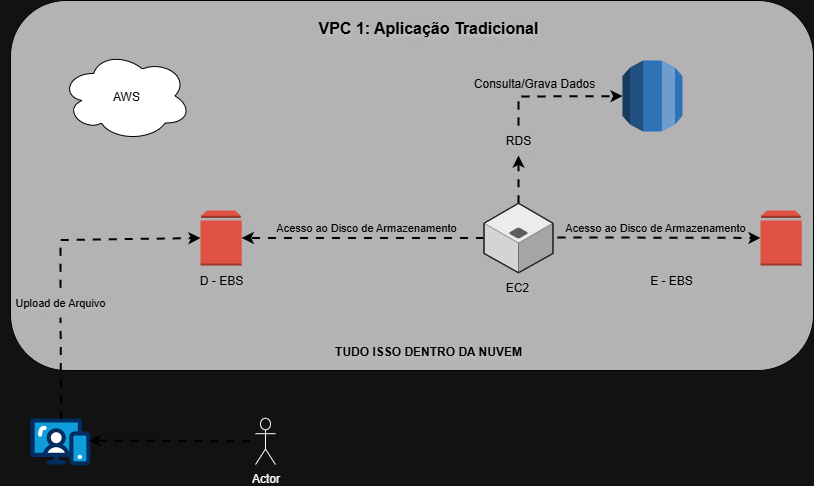
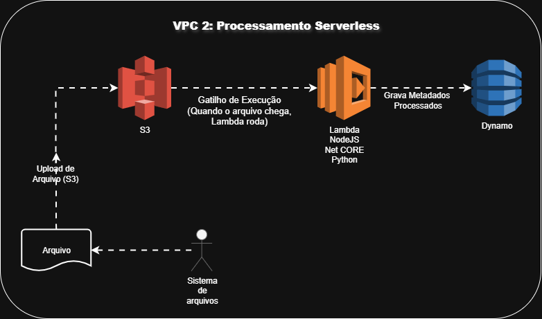

# 🏗️ Diagrama de Arquitetura AWS  

Este projeto de diagrama de arquitetura foi desenvolvido como uma atividade prática para a **Trilha de Computação na Nuvem do programa Code Girls Santander**, em parceria com a **DIO (Digital Innovation One)**.  

O objetivo principal desta entrega é demonstrar a compreensão sobre:  

- A organização de recursos em **Ambientes de Nuvem (VPCs)**.  
- A funcionalidade básica dos serviços AWS mais comuns em **dois fluxos distintos**.  

## 🔎 1. Visão Geral da Arquitetura  

O diagrama ilustra a comunicação entre os serviços de nuvem e está dividido em **dois escopos de rede isolados (VPCs - Virtual Private Cloud)**:  

### 🌐 VPC 1: Aplicação Tradicional (Ambiente de Servidor)  

Este fluxo representa uma **arquitetura clássica** de aplicação baseada em uma **máquina virtual dedicada**.  

| Componente    | Nome Técnico AWS             | Função no Diagrama                                                                 |
|---------------|------------------------------|------------------------------------------------------------------------------------|
| Servidor      | **EC2 (Elastic Compute Cloud)** | Máquina Virtual (VM) que executa o código da aplicação.                             |
| Banco de Dados| **RDS (Relational Database Service)** | Serviço de Banco de Dados Relacional gerenciado (ex: PostgreSQL/MySQL).             |
| Armazenamento | **EBS (Elastic Block Store)** | Volumes de disco persistente conectados diretamente ao servidor EC2.                |
| Interação     | **Actor**                     | Representa o usuário que acessa o sistema.                                          |

### ⚡ VPC 2: Processamento Serverless (Ambiente Sem Servidor)  

Este fluxo representa uma arquitetura **Serverless**, sem a necessidade de gerenciar servidores, ideal para **processamento de dados sob demanda**.  

| Componente    | Nome Técnico AWS             | Fluxo de Ação                                                                      |
|---------------|------------------------------|------------------------------------------------------------------------------------|
| Armazenamento | **S3 (Simple Storage Service)** | Armazena o arquivo antes do processamento.                                          |
| Processamento | **AWS Lambda**                | Gatilho: Executa o código (Node.js/Python) que processa o arquivo adicionado ao S3. |
| Banco de Dados| **DynamoDB**                  | Banco de Dados NoSQL que armazena metadados ou resultados do processamento.          |
| Fonte         | **Sistema de Arquivos**       | Origem do arquivo que é enviado para a nuvem.                                       |

## 📊 Diagramas das Arquiteturas 

  

 

## 👧🏻 Autora 
July Ribeiro - Aluna da **DIO**